# SC23 Deep Learning at Scale Tutorial

This repository contains the example code material for the SC23 tutorial:
*Deep Learning at Scale*.

**Contents**
* [Links](#links)
* [Installation](#installation-and-setup)
* [Model, data, and code overview](#model-data-and-training-code-overview)
* [Single GPU training](#single-gpu-training)
* [Single GPU performance](#single-gpu-performance-profiling-and-optimization)
* [Distributed training with data parallelism](#distributed-training-with-data-parallelism)
* [Multi-GPU Model Parallelism](#model-parallelism)

## Links

Tutorial slides: https://drive.google.com/drive/folders/1wN1bCjHk2iocI6nowuzSugQopAwetCjR?usp=sharing

Join the Slack workspace: https://join.slack.com/t/nersc-dl-tutorial/shared_invite/zt-25yvx25rr-RPWN1UclFvwgnRyr39Qt0w

NERSC JupyterHub: https://jupyter.nersc.gov

Data download (only needed if you want to run our examples elsewhere): https://portal.nersc.gov/project/dasrepo/pharring/sc23_data

## Installation and Setup

### Software environment

The instructions in this README are intended to be used with NERSC's Perlmutter machine.

Access to the Perlmutter machine is provided for this tutorial via [jupyter.nersc.gov](https://jupyter.nersc.gov). 
Training account setup instructions will be given during the session. Once you have your provided account credentials, you can log in to Jupyter via the link (leave the OTP field blank when logging into Jupyter).
Once logged into the hub, start a session by clicking the button for Perlmutter Shared CPU Node (other options will not work with this tutorial material). This will open up a session on a Perlmutter login node, from which you can submit jobs to the GPU nodes and monitor their progress.

To begin, start a terminal from JupyterHub and clone this repository with:
```bash
git clone https://github.com/NERSC/sc23-dl-tutorial.git
```
You can use the Jupyter file browser to view and edit source files and scripts. For all of the example commands provided below, make sure you are running them from within the top-level folder of the repository. In your terminal, change to the directory with
```bash
cd sc23-dl-tutorial
```

For running slurm jobs on Perlmutter, we will use training accounts which are provided under the `ntrain4` project. The slurm script `submit_pm.sh` included in the repository is configured to work automatically as is, but if you submit your own custom jobs via `salloc` or `sbatch` you must include the following flags for slurm:
* `-A ntrain4_g` is required for training accounts
* `--reservation=<reservation_name>` is required to access the set of GPU nodes we have reserved for the duration of the tutorial. For the morning session use `<reservation_name>` set to `sc23_dl_tutorial_1`, and for the afternoon session use `<reservation_name>` set to `sc23_dl_tutorial_2` (we have two different size reservations for the single-GPU and multi-GPU sections respectively)

The code can be run using the `nersc/pytorch:ngc-23.07-v0` docker container. On Perlmutter, docker containers are run via [shifter](https://docs.nersc.gov/development/shifter/), and this container is already downloaded and automatically invoked by our job submission scripts. Our container is based on the [NVIDIA ngc 23.07 pytorch container](https://docs.nvidia.com/deeplearning/frameworks/pytorch-release-notes/rel-23-07.html), with a few additional packages added.

### Installing Nsight Systems
In this tutorial, we will be generating profile files using NVIDIA Nsight Systems on the remote systems. In order to open and view these
files on your local computer, you will need to install the Nsight Systems program, which you can download [here](https://developer.nvidia.com/gameworksdownload#?search=nsight%20systems). Select the download option required for your system (e.g. Mac OS host for MacOS, Window Host for Windows, or Linux Host .rpm/.deb/.run for Linux). You may need to sign up and create a login to NVIDIA's developer program if you do not
already have an account to access the download. Proceed to run and install the program using your selected installation method.

## Model, data, and training code overview

The model in this repository is adapted from modern applications of deep learning for weather forecasting, e.g. [FourCastNet](https://arxiv.org/abs/2202.11214). [GraphCast](https://arxiv.org/abs/2212.12794), [Pangu-Weather](https://arxiv.org/abs/2211.02556), and others. These models are trained on a combination of observed and simulated data describing the atmospheric state on Earth over the past several decades, and they achieve impressive performance in terms of accuracy and forecast speed when compared against traditional numerical weather prediction (NWP) models.

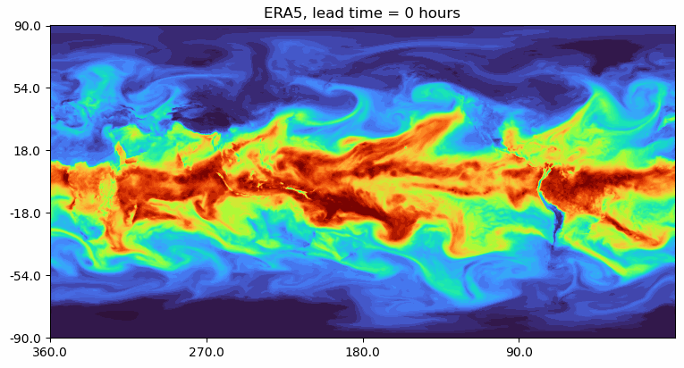

For these examples we will be using a [vision transformer](https://arxiv.org/abs/2010.11929) (ViT) architecture, for which our implementation can be found in [`networks/vit.py`](networks/vit.py). ViTs are a widely-used architecture in computer vision, known for scaling well to large datasets and being able to model long-range dependencies easily via the use of self-attention layers. While 'vanilla' ViTs are not necessarily state-of-the-art on the weather forecasting task, they are a good model to use for educational purposes as they are widely used in a variety of applications and the techniques outlined here (e.g. channel-wise tensor parallelism) would transfer well to other applications (e.g. NLP/LLMs).

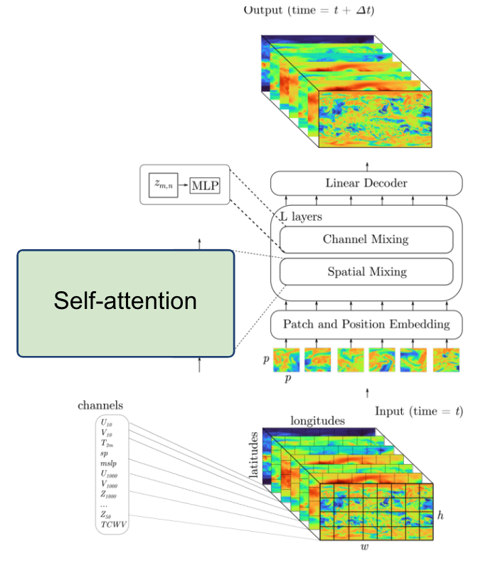

Data-driven weather models are typically trained on the [ERA5 reanalysis dataset](https://www.ecmwf.int/en/forecasts/dataset/ecmwf-reanalysis-v5) from the European Center for Medium-range Weather Forecasts (ECMWF). This dataset represents 40 years of atmospheric data on a 25km global grid, combining simulation outputs assimilated with observations. The basic data loading pipeline for training models is defined in [`utils/data_loader.py`](utils/data_loader.py), whose primary components are:
* The `ERA5Dataset`, which accesses the data stored on disk and serves input-output pairs of the atmospheric variables for training and validation. Each pair is a randomly-sampled snapshots of the atmosphere, separated by a 6 hour timestep. The model is given the first snapshot as input and is trained to predict the snapshot 6 hours later.
* For this repository, we will be using a spatially-downsampled version of the data so training runs a little faster.
* The above dataset object is passed to a PyTorch `DataLoader` which takes the samples and combines them into a batch for each training step.

It is common practice to decay the learning rate according to some schedule as the model trains, so that the optimizer can settle into sharper minima during gradient descent. Here we opt for the cosine learning rate decay schedule, which starts at an intial learning rate and decays continuously throughout training according to a cosine function. This is handled by the `LambdaLR` or `CosineAnnealingLR` utilities from PyTorch, set in [`train.py`](train.py) -- the `LambdaLR` uses custom logic to implement learning rate warm-up if desired for distributed training.

As we will see in the [Single GPU performance profiling and optimization](#Single-GPU-performance-profiling-and-optimization) section, we'll be able to speed up the baseline data loading pipeline significantly by making various improvements. Another option introduced in that section is to do data loading using NVIDIA's DALI library, for which the implementation can be found in [`utils/data_loader_dali.py`](utils/data_loader_dali.py).

The script to train the model is [`train.py`](train.py), which uses the following arguments to load the desired training setup:
```
--yaml_config YAML_CONFIG   path to yaml file containing training configs
--config CONFIG             name of desired config in yaml file
```

Based on the selected configuration, the train script will then:
1.  Set up the data loaders and construct our ViT model, the Adam optimizer, and our L2 loss function.
2.  Loop over training epochs to run the training. See if you can identify the following key components: 
    * Looping over data batches from our data loader.
    * Applying the forward pass of the model and computing the loss function.
    * Calling `backward()` on the loss value to backpropagate gradients. Note the use of the `grad_scaler` will be explained below when enabling mixed precision.
    * Applying the model to the validation dataset and logging training and validation metrics to visualize in TensorBoard (see if you can find where we construct the TensorBoard `SummaryWriter` and where our specific metrics are logged via the `add_scalar` call).

Besides the `train.py` script, we have a slightly more complex [`train_graph.py`](train_graph.py)
script, which implements the same functionality with added capability for using the CUDA Graphs APIs introduced in PyTorch 1.10. This topic will be covered in the [Single GPU performance profiling and optimization](#Single-GPU-performance-profiling-and-optimization) section.

More info on the model and data can be found in the [slides](https://drive.google.com/drive/folders/1wN1bCjHk2iocI6nowuzSugQopAwetCjR?usp=drive_link). If you are experimenting with this repository after the tutorial date, you can download the data from here: https://portal.nersc.gov/project/dasrepo/pharring/sc23_data.
Note that you will have to adjust the data path in `submit_pm.sh` to point yor personal copy after downloading.

## Single GPU training

First, let us look at the performance of the training script without optimizations on a single GPU.

On Perlmutter for the tutorial, we will be submitting jobs to the batch queue. To submit this job, use the following command:
```
sbatch -n 1 ./submit_pm.sh --config=short
```
`submit_pm.sh` is a batch submission script that defines resources to be requested by SLURM as well as the command to run.
Note that any arguments for `train.py`, such as the desired config (`--config`), can be added after `submit_pm.sh` when submitting, and they will be passed to `train.py` properly.
When using batch submission, you can see the job output by viewing the file `vit-era5-<jobid>.out` in the submission
directory. You can find the job id of your job using the command `squeue --me` and looking at the first column of the output.

For interactive jobs, you can run the Python script directly using the following command (**NOTE: please don't run training on the Perlmutter login nodes**):
```
python train.py --config=short
```
This will run 128 training iterations on a single GPU using a default batch size of 16.
See [`config/ViT.yaml`](config/ViT.yaml) for specific configuration details.
Note we will use the default batch size for the optimization work in the next section
and will push beyond to larger batch sizes in the distributed training section.

While the model predicts many atmospheric variables, we will focus on In the baseline configuration, the model converges to a RMSE of about `0.13` on
the validation dataset in about 22k training iterations. This takes around 22 hours hours to run, so to save time we have already included an example TensorBoard log for the `base` config in the `example_logs` directory for you.
We want to compare our training results against the `base` config baseline, and TensorBoard makes this easy as long as all training runs are stored in the same place. 
To copy the example TensorBoard log to the scratch directory where our training jobs will output their logs, do
```
mkdir -p $SCRATCH/sc23-dl-tutorial/logs
cp -r ./example_logs/base $SCRATCH/sc23-dl-tutorial/logs
```

To view results in TensorBoard, open the [`start_tensorboard.ipynb`](start_tensorboard.ipynb) notebook and follow the instructions in it to launch a TensorBoard session in your browser. Once you have TensorBoard open, you should see a dashboard with data for the loss values, learning rate, and average iterations per second. Looking at the validation loss for the `base` config, you should see the following training curve:
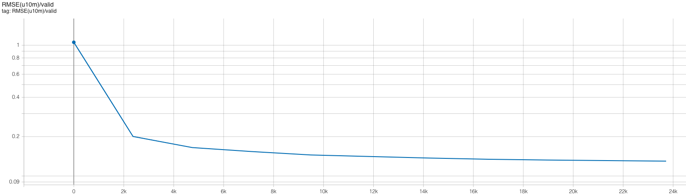

As our training with the `short` config runs, it should also dump the training metrics to the TensorBoard directory, and TensorBoard will parse the data and display it for you. You can hit the refresh button in the upper-right corner of TensorBoard to update the plots with the latest data.

## Single GPU performance profiling and optimization

This is the performance of the baseline script for the first four epochs on a 40GB A100 card with batch size 16 using the `short` config, which limits the number of training and validation samples to 512 and 128 samples respectively:
```
2023-09-26 21:29:00,679 - root - INFO - Starting Training Loop...
2023-09-26 21:30:08,688 - root - INFO - Time taken for epoch 1 is 63.020848512649536 sec, avg 8.12429556382808 samples/sec
2023-09-26 21:30:08,690 - root - INFO -   Avg train loss=0.579061
2023-09-26 21:30:17,316 - root - INFO -   Avg val loss=0.419114
2023-09-26 21:30:17,316 - root - INFO -   Total validation time: 8.258756637573242 sec
2023-09-26 21:31:11,898 - root - INFO - Time taken for epoch 2 is 54.578805923461914 sec, avg 9.380930772248819 samples/sec
2023-09-26 21:31:11,898 - root - INFO -   Avg train loss=0.390744
2023-09-26 21:31:18,989 - root - INFO -   Avg val loss=0.375897
2023-09-26 21:31:18,989 - root - INFO -   Total validation time: 6.766376972198486 sec
2023-09-26 21:32:13,578 - root - INFO - Time taken for epoch 3 is 54.58618688583374 sec, avg 9.37966231403635 samples/sec
2023-09-26 21:32:13,579 - root - INFO -   Avg train loss=0.356790
2023-09-26 21:32:20,685 - root - INFO -   Avg val loss=0.353825
2023-09-26 21:32:20,685 - root - INFO -   Total validation time: 6.767474889755249 sec
2023-09-26 21:33:15,322 - root - INFO - Time taken for epoch 4 is 54.63401126861572 sec, avg 9.371451740614114 samples/sec
2023-09-26 21:33:15,322 - root - INFO -   Avg train loss=0.343523
2023-09-26 21:33:22,444 - root - INFO -   Avg val loss=0.347524
2023-09-26 21:33:22,444 - root - INFO -   Total validation time: 6.78272819519043 sec
```
After the first epoch, we see that the throughput achieved is about 9.3 samples/s.

### Profiling with Nsight Systems
#### Adding NVTX ranges and profiler controls
Before generating a profile with Nsight, we can add NVTX ranges to the script to add context to the produced timeline.
We can add some manually defined NVTX ranges to the code using `torch.cuda.nvtx.range_push` and `torch.cuda.nvtx.range_pop`.
We can also add calls to `torch.cuda.profiler.start()` and `torch.cuda.profiler.stop()` to control the duration of the profiling
(e.g., limit profiling to single epoch). You can `grep` through `train.py` for these API calls to see what we've added in this example.

To generate a profile using our scripts on Perlmutter, run the following command: 
```
ENABLE_PROFILING=1 PROFILE_OUTPUT=baseline sbatch -n1 submit_pm.sh --config=short
```
If running interactively, this is the full command from the batch submission script:
```
nsys profile -o baseline --trace=cuda,nvtx -c cudaProfilerApi --kill none -f true python train.py --config=short
```
This command will run four epochs of the training script, profiling only the last epoch run. It will produce a file `baseline.nsys-rep` that can be opened in the Nsight System's program. The arg `--trace=cuda,nvtx` is optional and is used here to disable OS Runtime tracing for speed. The arg `-c cudaProfilerApi` instructs the profiler to only profile the duration of the runtime between the `torch.cuda.profiler.start()` and `torch.cuda.profiler.stop()` calls.

Loading this profile ([`baseline.nsys-rep`](sample_nsys_profiles/baseline.nsys-rep)) in Nsight Systems will look like this:
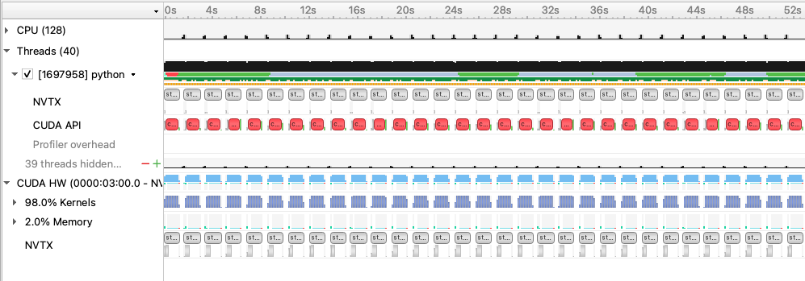

From this zoomed out view, we can see some idle gaps between training iterations. These gaps are due to the data loading, which we will address in the next section.

Beyond this, we can zoom into a single iteration and get an idea of where compute time is being spent:
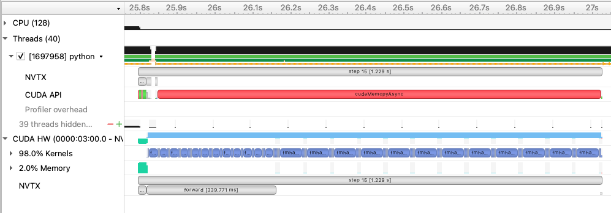


### Data loading optimizations
#### Improving the native PyTorch dataloader performance
The PyTorch dataloader has several knobs we can adjust to improve performance. If you look at the `DataLoader` initialization in
`utils/data_loader.py`, you'll see we've already set several useful options, like `pin_memory` and `persistent_workers`.
`pin_memory` has the data loader read input data into pinned host memory, which typically yields better host-to-device and device-to-host
memcopy bandwidth. `persistent_workers` allows PyTorch to reuse workers between epochs, instead of the default behavior which is to
respawn them. One knob we've left to adjust is the `num_workers` argument, which we can control via the `--num_data_workers` command
line arg to our script. The default used by PyTorch is `num_workers=0`, which runs data loading *sequentially* in the training Python process. This is one source of the large gaps we observed in the first profile. By setting `num_workers>0`, we enable PyTorch to use multiprocessing to perform data loading in a side process to hide this cost. We can experiment with the number of workers to see if performance is improved.

We can run this experiment on Perlmutter by running the following command:
```
sbatch -n 1 ./submit_pm.sh --config=short --num_data_workers <value of your choice>
```
If running interactively:
```
python train.py --config=short --num_data_workers <value of your choice>
```

This is the performance of the training script for the first four epochs on a 40GB A100 card with batch size 16 and 4 data workers:
```
2023-09-26 21:18:44,034 - root - INFO - Time taken for epoch 1 is 43.38622999191284 sec, avg 11.800979252989633 samples/sec
2023-09-26 21:18:44,035 - root - INFO -   Avg train loss=0.577452
2023-09-26 21:18:49,678 - root - INFO -   Avg val loss=0.418861
2023-09-26 21:18:49,679 - root - INFO -   Total validation time: 5.192107677459717 sec
2023-09-26 21:19:30,999 - root - INFO - Time taken for epoch 2 is 41.31834650039673 sec, avg 12.391589774655767 samples/sec
2023-09-26 21:19:31,001 - root - INFO -   Avg train loss=0.390701
2023-09-26 21:19:36,231 - root - INFO -   Avg val loss=0.372989
2023-09-26 21:19:36,232 - root - INFO -   Total validation time: 4.828763484954834 sec
2023-09-26 21:20:17,169 - root - INFO - Time taken for epoch 3 is 40.93515610694885 sec, avg 12.507586355902198 samples/sec
2023-09-26 21:20:17,171 - root - INFO -   Avg train loss=0.356448
2023-09-26 21:20:22,409 - root - INFO -   Avg val loss=0.355308
2023-09-26 21:20:22,409 - root - INFO -   Total validation time: 4.8364222049713135 sec
2023-09-26 21:21:03,627 - root - INFO - Time taken for epoch 4 is 41.21541452407837 sec, avg 12.42253671137738 samples/sec
2023-09-26 21:21:03,629 - root - INFO -   Avg train loss=0.343769
2023-09-26 21:21:08,695 - root - INFO -   Avg val loss=0.347322
2023-09-26 21:21:08,695 - root - INFO -   Total validation time: 4.662991523742676 sec
```

This is the performance of the training script for the first four epochs on a 40GB A100 card with batch size 16 and 8 data workers:
```
2023-09-26 21:18:59,332 - root - INFO - Time taken for epoch 1 is 45.54166626930237 sec, avg 11.242452065156796 samples/sec
2023-09-26 21:18:59,333 - root - INFO -   Avg train loss=0.577049
2023-09-26 21:19:05,821 - root - INFO -   Avg val loss=0.419312
2023-09-26 21:19:05,821 - root - INFO -   Total validation time: 6.034433841705322 sec
2023-09-26 21:19:47,276 - root - INFO - Time taken for epoch 2 is 41.4513418674469 sec, avg 12.351831736527942 samples/sec
2023-09-26 21:19:47,277 - root - INFO -   Avg train loss=0.389672
2023-09-26 21:19:53,126 - root - INFO -   Avg val loss=0.373399
2023-09-26 21:19:53,126 - root - INFO -   Total validation time: 5.442654848098755 sec
2023-09-26 21:20:36,164 - root - INFO - Time taken for epoch 3 is 43.03392195701599 sec, avg 11.897590940268149 samples/sec
2023-09-26 21:20:36,165 - root - INFO -   Avg train loss=0.355648
2023-09-26 21:20:41,650 - root - INFO -   Avg val loss=0.353144
2023-09-26 21:20:41,650 - root - INFO -   Total validation time: 5.0764687061309814 sec
2023-09-26 21:21:24,205 - root - INFO - Time taken for epoch 4 is 42.55116081237793 sec, avg 12.032574205380119 samples/sec
2023-09-26 21:21:24,206 - root - INFO -   Avg train loss=0.342547
2023-09-26 21:21:30,034 - root - INFO -   Avg val loss=0.346312
2023-09-26 21:21:30,034 - root - INFO -   Total validation time: 5.32970404624939 sec
```

This is the performance of the training script for the first four epochs on a 40GB A100 card with batch size 16 and 16 data workers:
```
2023-09-26 21:27:28,037 - root - INFO - Time taken for epoch 1 is 47.84179139137268 sec, avg 10.701940397915974 samples/sec
2023-09-26 21:27:28,037 - root - INFO -   Avg train loss=0.575174
2023-09-26 21:27:34,156 - root - INFO -   Avg val loss=0.418625
2023-09-26 21:27:34,156 - root - INFO -   Total validation time: 5.6687445640563965 sec
2023-09-26 21:28:20,330 - root - INFO - Time taken for epoch 2 is 46.170273542404175 sec, avg 11.089386324076328 samples/sec
2023-09-26 21:28:20,331 - root - INFO -   Avg train loss=0.388281
2023-09-26 21:28:25,466 - root - INFO -   Avg val loss=0.373171
2023-09-26 21:28:25,467 - root - INFO -   Total validation time: 4.725477695465088 sec
2023-09-26 21:29:11,989 - root - INFO - Time taken for epoch 3 is 46.51985311508179 sec, avg 11.006053667740602 samples/sec
2023-09-26 21:29:11,991 - root - INFO -   Avg train loss=0.354430
2023-09-26 21:29:17,389 - root - INFO -   Avg val loss=0.351720
2023-09-26 21:29:17,390 - root - INFO -   Total validation time: 4.990921974182129 sec
2023-09-26 21:30:02,644 - root - INFO - Time taken for epoch 4 is 45.25181460380554 sec, avg 11.314463397384783 samples/sec
2023-09-26 21:30:02,645 - root - INFO -   Avg train loss=0.341476
2023-09-26 21:30:07,853 - root - INFO -   Avg val loss=0.345648
2023-09-26 21:30:07,853 - root - INFO -   Total validation time: 4.801238775253296 sec
```

Increasing the number of workers to 4 improves throughput to around 12.4 samples per second, while increasing to more workers yields a slight degradation in performance.

We can run the 4 worker configuration through profiler using the instructions in the previous section with the added `--num_data_workers`
argument and load that profile in Nsight Systems. This is what this profile ([`4workers.nsys-rep`](sample_nsys_profiles/4workers.nsys-rep)) looks like:
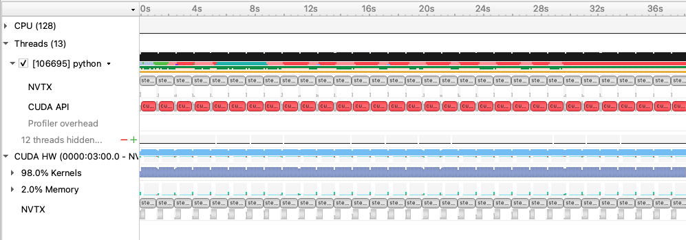

and zoomed in:
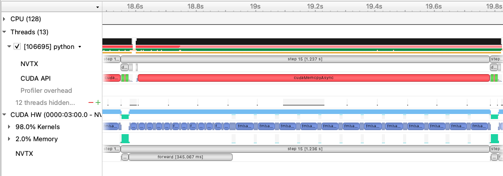

With 4 data workers, the idle gaps between steps are resolved, improving the throughput. Looking at the zoomed in profile, we
still see that the H2D copy in of the input data (i.e. the light green activity at the beginning of the step) takes some time and runs in same CUDA stream as the compute. One option here is to implement a prefetching
mechanism in PyTorch directly using CUDA streams to concurrently load and copy in the next batch of input during the current batch, however
this is left as an exercise outside of this tutorial. A good example of this can be found in [here](https://github.com/NVIDIA/DeepLearningExamples/blob/41f582bd9f65f6ebede77532b7cd64f038a8a380/PyTorch/Classification/ConvNets/image_classification/dataloaders.py#L354)

#### Using NVIDIA DALI
While we were able to get more performance out of the PyTorch native DataLoader, there are several potential overheads we cannot overcome in
PyTorch alone:
1. The PyTorch DataLoader will use CPU operations for all I/O operations as well as data augmentations
2. The PyTorch DataLoader uses multi-processing to spawn data workers, which has performance overheads compared to true threads

The NVIDIA DALI library is a data loading library that can address both of these points:
1. DALI can perform a wide array of data augmentation operations on the GPU, benefitting from acceleration relative to the CPU.
2. DALI maintains its own worker threads in the C++ backend, enabling much more performant threading and concurrent operation.

For this tutorial, we've provided an alternative data loader using DALI to accelerate the data augementations used in this training script that can be found in `utils/data_loader_dali.py`. This data loader is enabled via the command line
argument `--data_loader_config=dali` to the training script.

We can run this experiment on Perlmutter using DALI with 8 worker threads by running the following command:
```
sbatch -n 1 ./submit_pm.sh --config=short --num_data_workers 8 --data_loader_config=dali
```
If running interactively:
```
python train.py --config=short --num_data_workers 8 --data_loader_config=dali
```

This is the performance of the training script for the first four epochs on a 40GB A100 card with batch size 16 and DALI:
```
2023-09-26 22:01:24,018 - root - INFO - Time taken for epoch 1 is 38.48570990562439 sec, avg 12.887900501674608 samples/sec
2023-09-26 22:01:24,020 - root - INFO -   Avg train loss=0.587751
2023-09-26 22:01:28,215 - root - INFO -   Avg val loss=0.425913
2023-09-26 22:01:28,215 - root - INFO -   Total validation time: 3.625275135040283 sec
2023-09-26 22:02:06,757 - root - INFO - Time taken for epoch 2 is 38.5366051197052 sec, avg 13.286069138928777 samples/sec
2023-09-26 22:02:06,759 - root - INFO -   Avg train loss=0.394755
2023-09-26 22:02:10,374 - root - INFO -   Avg val loss=0.376960
2023-09-26 22:02:10,375 - root - INFO -   Total validation time: 3.0912325382232666 sec
2023-09-26 22:02:48,918 - root - INFO - Time taken for epoch 3 is 38.53870248794556 sec, avg 13.285346079312022 samples/sec
2023-09-26 22:02:48,921 - root - INFO -   Avg train loss=0.359927
2023-09-26 22:02:52,485 - root - INFO -   Avg val loss=0.355281
2023-09-26 22:02:52,485 - root - INFO -   Total validation time: 3.052870988845825 sec
2023-09-26 22:03:31,039 - root - INFO - Time taken for epoch 4 is 38.549081325531006 sec, avg 13.281769173080217 samples/sec
2023-09-26 22:03:31,041 - root - INFO -   Avg train loss=0.345901
2023-09-26 22:03:34,623 - root - INFO -   Avg val loss=0.349484
2023-09-26 22:03:34,623 - root - INFO -   Total validation time: 3.0705220699310303 sec
```

We can run the DALI case through profiler using the instructions in the earlier section with the added `--data_loader_config=dali`
argument and load that profile in Nsight Systems. This is what this profile ([`dali.nsys-rep`](sample_nsys_profiles/dali.nsys-rep)) looks like:
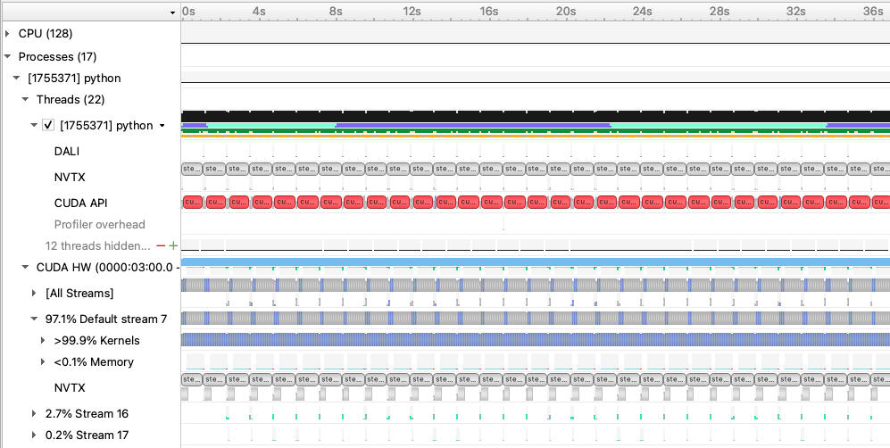

and zoomed in to a single iteration:
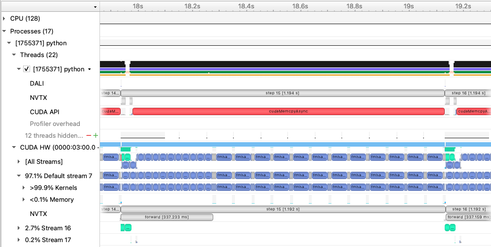

With DALI, you will see that there are now multiple CUDA stream rows in the timeline view, corresponding to internal streams DALI uses
to run data augmentation kernels and any memory movement concurrently with the existing PyTorch compute kernels. Stream 16 in this view shows concurrent H2D memory copies of the batch input data, which is an improvement over the native dataloader.

### Enabling Mixed Precision Training
Now that the data loading performance has been improved, we can start focusing on pushing compute performance. As a first step to improve the compute performance of this training script, we can enable automatic mixed precision (AMP) in PyTorch. AMP provides a simple way for users to convert existing FP32 training scripts to mixed FP32/FP16 of FP32/BF16 precision, unlocking
faster computation with Tensor Cores on NVIDIA GPUs.

The AMP module in torch is composed of two main parts: `torch.cuda.amp.GradScaler` and `torch.cuda.amp.autocast`. `torch.cuda.amp.GradScaler` handles automatic loss scaling to control the range of FP16 gradients when using FP16 precision. Note that since BF16 precision maintains the range of FP32, loss scaling is not required when using AMP with this data type.
The `torch.cuda.amp.autocast` context manager handles converting model operations to BF16/FP16 where appropriate.

As a quick note, the A100 GPUs we've been using to report results thus far have been able to benefit from Tensor Core compute via the use of TF32 precision operations, enabled by default for CUDNN and CUBLAS in PyTorch. We can measure the benefit of TF32 precision usage on the A100 GPU by temporarily disabling it via setting the environment variable `NVIDIA_TF32_OVERRIDE=0`.  
We can run this experiment on Perlmutter by running the following command:
```
NVIDIA_TF32_OVERRIDE=0 sbatch -n 1 ./submit_pm.sh --config=short --num_data_workers 8 --data_loader_config=dali
```
yields the following result for 4 epochs:
```
2023-09-26 22:37:05,159 - root - INFO - Time taken for epoch 1 is 50.52403998374939 sec, avg 9.817108848768507 samples/sec
2023-09-26 22:37:05,160 - root - INFO -   Avg train loss=0.585963
2023-09-26 22:37:10,101 - root - INFO -   Avg val loss=0.428734
2023-09-26 22:37:10,102 - root - INFO -   Total validation time: 4.387829065322876 sec
2023-09-26 22:38:00,735 - root - INFO - Time taken for epoch 2 is 50.62814474105835 sec, avg 10.112952047100768 samples/sec
2023-09-26 22:38:00,736 - root - INFO -   Avg train loss=0.394807
2023-09-26 22:38:05,347 - root - INFO -   Avg val loss=0.378771
2023-09-26 22:38:05,348 - root - INFO -   Total validation time: 4.096112012863159 sec
2023-09-26 22:38:55,989 - root - INFO - Time taken for epoch 3 is 50.63650107383728 sec, avg 10.111283148363873 samples/sec
2023-09-26 22:38:55,991 - root - INFO -   Avg train loss=0.360278
2023-09-26 22:39:00,564 - root - INFO -   Avg val loss=0.355521
2023-09-26 22:39:00,564 - root - INFO -   Total validation time: 4.063924789428711 sec
2023-09-26 22:39:51,199 - root - INFO - Time taken for epoch 4 is 50.62860679626465 sec, avg 10.112859752596927 samples/sec
2023-09-26 22:39:51,200 - root - INFO -   Avg train loss=0.345876
2023-09-26 22:39:55,772 - root - INFO -   Avg val loss=0.349507
2023-09-26 22:39:55,773 - root - INFO -   Total validation time: 4.065291404724121 sec
```
From here, we can see that running in FP32 without TF32 acceleration is reduced, hence we are seeing some benefits from
TF32 Tensor Core operations without any code changes to add AMP. With that said, AMP can still provide more performance improvement for A100 GPUs,
as TF32 is a compute type only, leaving all data in full precision FP32. FP16 precision has the compute benefits of Tensor Cores combined with a reduction in storage and memory bandwidth requirements. 

We can run this experiment using AMP on Perlmutter by running one of the following commands:
```
sbatch -n 1 ./submit_pm.sh --config=short --num_data_workers 8 --data_loader_config=dali --amp_mode=fp16
```
for AMP with FP16 precision or
```
sbatch -n 1 ./submit_pm.sh --config=short --num_data_workers 8 --data_loader_config=dali --amp_mode=bf16
```
for AMP with BF16 precision.

If running interactively:
```
python train.py --config=short --num_data_workers 8 --data_loader_config=dali --amp_mode=fp16
```
or
```
python train.py --config=short --num_data_workers 8 --data_loader_config=dali --amp_mode=bf16
```

This is the performance of the training script for the first four epochs on a 40GB A100 card with batch size 16, DALI, and AMP FP16:
```
2023-09-26 22:42:50,782 - root - INFO - Time taken for epoch 1 is 13.934328317642212 sec, avg 35.59554423387713 samples/sec
2023-09-26 22:42:50,782 - root - INFO -   Avg train loss=0.585250
2023-09-26 22:42:53,841 - root - INFO -   Avg val loss=0.427797
2023-09-26 22:42:53,841 - root - INFO -   Total validation time: 2.5032312870025635 sec
2023-09-26 22:43:05,905 - root - INFO - Time taken for epoch 2 is 12.058186531066895 sec, avg 42.46077954432662 samples/sec
2023-09-26 22:43:05,906 - root - INFO -   Avg train loss=0.396558
2023-09-26 22:43:07,896 - root - INFO -   Avg val loss=0.381889
2023-09-26 22:43:07,896 - root - INFO -   Total validation time: 1.4918978214263916 sec
2023-09-26 22:43:19,939 - root - INFO - Time taken for epoch 3 is 12.037509441375732 sec, avg 42.53371534149218 samples/sec
2023-09-26 22:43:19,940 - root - INFO -   Avg train loss=0.362181
2023-09-26 22:43:21,919 - root - INFO -   Avg val loss=0.357079
2023-09-26 22:43:21,919 - root - INFO -   Total validation time: 1.4730119705200195 sec
2023-09-26 22:43:33,977 - root - INFO - Time taken for epoch 4 is 12.047151803970337 sec, avg 42.499671983153895 samples/sec
2023-09-26 22:43:33,978 - root - INFO -   Avg train loss=0.347396
2023-09-26 22:43:35,959 - root - INFO -   Avg val loss=0.351097
2023-09-26 22:43:35,960 - root - INFO -   Total validation time: 1.48984694480896 sec
```

This is the performance of the training script for the first four epochs on a 40GB A100 card with batch size 16, DALI, and AMP BF16:
```
2023-09-26 22:55:22,111 - root - INFO - Time taken for epoch 1 is 13.740016222000122 sec, avg 36.09893845727918 samples/sec
2023-09-26 22:55:22,112 - root - INFO -   Avg train loss=0.581764
2023-09-26 22:55:25,160 - root - INFO -   Avg val loss=0.423542
2023-09-26 22:55:25,161 - root - INFO -   Total validation time: 2.495091438293457 sec
2023-09-26 22:55:37,176 - root - INFO - Time taken for epoch 2 is 12.007216453552246 sec, avg 42.64102358615585 samples/sec
2023-09-26 22:55:37,177 - root - INFO -   Avg train loss=0.392484
2023-09-26 22:55:39,214 - root - INFO -   Avg val loss=0.374372
2023-09-26 22:55:39,214 - root - INFO -   Total validation time: 1.5221989154815674 sec
2023-09-26 22:55:51,228 - root - INFO - Time taken for epoch 3 is 12.009136199951172 sec, avg 42.63420711325447 samples/sec
2023-09-26 22:55:51,229 - root - INFO -   Avg train loss=0.357453
2023-09-26 22:55:53,237 - root - INFO -   Avg val loss=0.353668
2023-09-26 22:55:53,237 - root - INFO -   Total validation time: 1.491905927658081 sec
2023-09-26 22:56:05,255 - root - INFO - Time taken for epoch 4 is 12.012868881225586 sec, avg 42.620959661033474 samples/sec
2023-09-26 22:56:05,256 - root - INFO -   Avg train loss=0.343864
2023-09-26 22:56:07,237 - root - INFO -   Avg val loss=0.347740
2023-09-26 22:56:07,237 - root - INFO -   Total validation time: 1.470574140548706 sec
```

For this model, we see a massive improvement when using AMP with either FP16 or BF16 precision, improving throughput to over 42 samples/s in each case. BF16 has a slight edge over FP16 due to the lack of loss scaling.

We can run the case with AMP BF16 enabled through profiler using the instructions in the earlier section with the added `--amp_mode=bf16`
argument and load that profile in Nsight Systems. This is what this profile ([`dali_amp_bf16.nsys-rep`](sample_nsys_profiles/dali_amp_bf16.nsys-rep)) looks like:
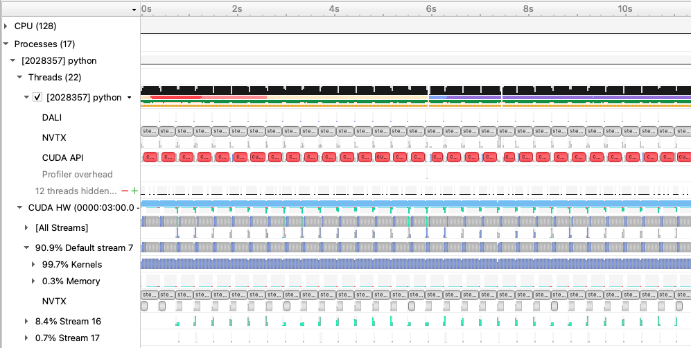

and zoomed in to a single iteration:
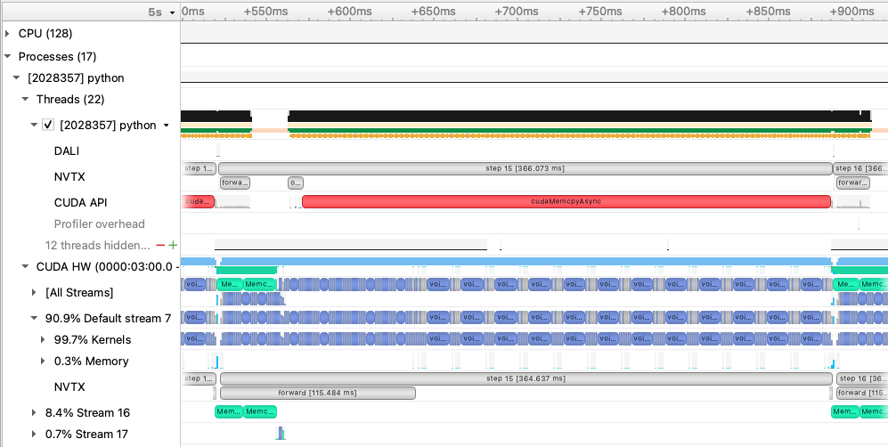

With AMP enabled, we see that the `forward` (and, correspondingly the backward) time is significantly reduced. The transformer
architecture we are using relies mainly on GEMM operations that greatly benefit from mixed precision.

### Just-in-time (JIT) compiliation via `torch.compile` and fused optimizers
While AMP provided a large increase in compute speed already, there are a few other optimizations available for PyTorch to improve
compute throughput. A first (and simple change) is to enable the `fused` option in the Adam optimizer from `torch.optim.Adam`.
In the past, this fused optimizer was mainly available in
[APEX](https://github.com/NVIDIA/apex) but has now been made available in PyTorch directly. Enabling the `fused` option resultsin fewer kernels to perform the weight
update than the unfused Adam optimizer, reducing latency and making more efficient use of GPU bandwidth by increasing register
reuse. We can enabled the use of the fused optimizer in our training script by adding the flag `--enable_fused`. 

We can run this experiment using the fused optimizer on Perlmutter by running the following command:
```
sbatch -n 1 ./submit_pm.sh --config=short --num_data_workers 8 --data_loader_config=dali --amp_mode=bf16 --enable_fused
```
If running interactively:
```
python train.py --config=short --num_data_workers 8 --data_loader_config=dali --amp_mode=bf16 --enable_fused
```

This is the performance of the training script for the first four epochs on a 40GB A100 card with batch size 16, DALI, and AMP, and the fused optimizer:
```
2023-09-26 23:06:32,768 - root - INFO - Time taken for epoch 1 is 13.392464637756348 sec, avg 37.0357520752129 samples/sec
2023-09-26 23:06:32,769 - root - INFO -   Avg train loss=0.587116
2023-09-26 23:06:35,805 - root - INFO -   Avg val loss=0.428104
2023-09-26 23:06:35,806 - root - INFO -   Total validation time: 2.46842885017395 sec
2023-09-26 23:06:47,807 - root - INFO - Time taken for epoch 2 is 11.996378421783447 sec, avg 42.67954727655909 samples/sec
2023-09-26 23:06:47,808 - root - INFO -   Avg train loss=0.395509
2023-09-26 23:06:49,794 - root - INFO -   Avg val loss=0.377574
2023-09-26 23:06:49,794 - root - INFO -   Total validation time: 1.474884033203125 sec
2023-09-26 23:07:01,795 - root - INFO - Time taken for epoch 3 is 11.994306564331055 sec, avg 42.686919602555214 samples/sec
2023-09-26 23:07:01,796 - root - INFO -   Avg train loss=0.359626
2023-09-26 23:07:03,782 - root - INFO -   Avg val loss=0.356546
2023-09-26 23:07:03,782 - root - INFO -   Total validation time: 1.4720070362091064 sec
2023-09-26 23:07:15,797 - root - INFO - Time taken for epoch 4 is 12.009339809417725 sec, avg 42.63348428183284 samples/sec
2023-09-26 23:07:15,798 - root - INFO -   Avg train loss=0.345925
2023-09-26 23:07:17,786 - root - INFO -   Avg val loss=0.349518
2023-09-26 23:07:17,786 - root - INFO -   Total validation time: 1.4778716564178467 sec
```

In additional to optimizer fusion, for more general fusion of operations in PyTorch, we can enable
JIT compilation, done in our training script via the flag `--enable_jit`. This option wraps the model in `torch.compile` which
will compile/fuse eligible operations in the model, further reducing latency.

We can run this experiment using JIT on Perlmutter by running the following command:
```
sbatch -n 1 ./submit_pm.sh --config=short --num_data_workers 8 --data_loader_config=dali --amp_mode=bf16 --enable_fused --enable_jit
```
If running interactively:
```
python train.py --config=short --num_data_workers 8 --data_loader_config=dali --amp_mode=bf16 --enable_fused --enable_jit
```

This is the performance of the training script for the first four epochs on a 40GB A100 card with batch size 16, DALI, AMP, fused optimizer and JIT:
```
2023-09-26 23:13:06,278 - root - INFO - Time taken for epoch 1 is 43.2601523399353 sec, avg 11.465516720848926 samples/sec
2023-09-26 23:13:06,279 - root - INFO -   Avg train loss=0.586837
2023-09-26 23:13:16,808 - root - INFO -   Avg val loss=0.429435
2023-09-26 23:13:16,808 - root - INFO -   Total validation time: 9.924283266067505 sec
2023-09-26 23:13:28,794 - root - INFO - Time taken for epoch 2 is 11.979468584060669 sec, avg 42.73979237119447 samples/sec
2023-09-26 23:13:28,794 - root - INFO -   Avg train loss=0.397797
2023-09-26 23:13:30,768 - root - INFO -   Avg val loss=0.381870
2023-09-26 23:13:30,768 - root - INFO -   Total validation time: 1.462252140045166 sec
2023-09-26 23:13:42,724 - root - INFO - Time taken for epoch 3 is 11.948866605758667 sec, avg 42.849252309273034 samples/sec
2023-09-26 23:13:42,724 - root - INFO -   Avg train loss=0.362702
2023-09-26 23:13:44,678 - root - INFO -   Avg val loss=0.357342
2023-09-26 23:13:44,679 - root - INFO -   Total validation time: 1.4342505931854248 sec
2023-09-26 23:13:56,639 - root - INFO - Time taken for epoch 4 is 11.952066659927368 sec, avg 42.83777982234843 samples/sec
2023-09-26 23:13:56,640 - root - INFO -   Avg train loss=0.347776
2023-09-26 23:13:58,597 - root - INFO -   Avg val loss=0.351206
2023-09-26 23:13:58,597 - root - INFO -   Total validation time: 1.4387221336364746 sec
```

Running a profile ([`dali_amp_bf16_fused_jit.nsys-rep`](sample_nsys_profiles/dali_amp_bf16_fused_jit.nsys-rep)) using these new options and loading in Nsight Systems looks like this:
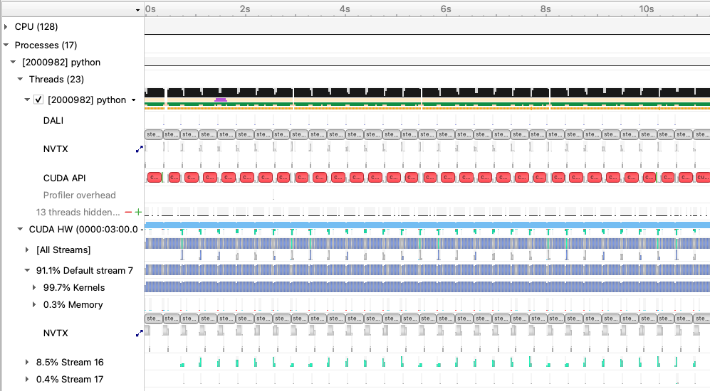

and zoomed in to a single iteration:
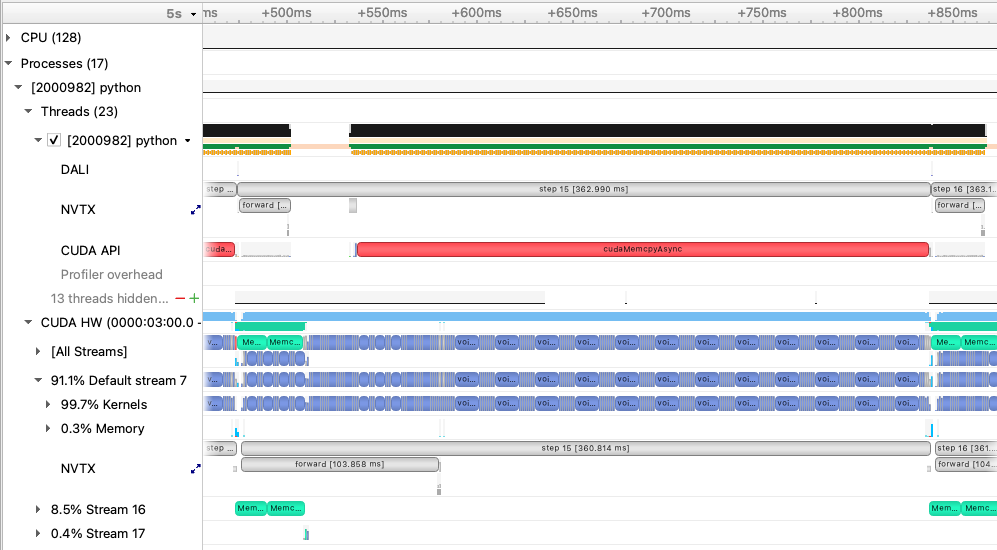

As the compute cost of this model is mostly dominated by large GEMMs, latency reductions via optimizer and pointwise operation fusion are less impactful, but they still provide a small performance boost in this case.


### Using CUDA Graphs (optional)
In this repository, we've included an alternative training script [train_graph.py](train_graph.py) that illustrates applying
PyTorch's new CUDA Graphs functionality to the existing model and training loop. Our tutorial model configuration does not benefit
much using CUDA Graphs, but for models with more CPU latency issues (e.g. from many small kernel launches), CUDA graphs are 
something to consider to improve. Compare [train.py](train.py) and [train_graph.py](train_graph.py) to see
how to use CUDA Graphs in PyTorch.

## Distributed training with data parallelism

Instructions for hands-on with mulit-GPU and multi-node training using distributed data parallelism.

Now that we have model training code that is optimized for training on a single GPU,
we are ready to utilize multiple GPUs and multiple nodes to accelerate the workflow
with *distributed training*. We will use the recommended `DistributedDataParallel`
wrapper in PyTorch with the NCCL backend for optimized communication operations on
systems with NVIDIA GPUs. Refer to the PyTorch documentation for additional details
on the distributed package: https://pytorch.org/docs/stable/distributed.html

### Code basics

To submit a multi-GPU job, use ...

Quiz questions.

### Scaling and convergence

Can we speed up training by scaling to multiple GPUs with data-parallelism?

Describe the DP configs and give instructions to submit them.

Analysis with tensorboard.

Quiz questions.

## Model parallelism
Now that we are familiar with distributed data parallel training, we are ready to move to more advanced parallelism in the form of model parallelism. One of the main motivations to explore this dimension is the need to use a larger model and/or process higher resolution images: both these can lead to higher accuracies and/or better emulation of physical phenomena. However, they will inflate the memory consumption (activation and weights) as well as computational cost.  At some point, the model (activation and weights) will no longer fit on a single GPU and we need to partition/shard the model across multiple GPUs. 
We will increase our model size to motivate this partition and show you the building blocks of implementing model parallelism, motivated by the megatron-style model parallelism. We will focus on tensor parallelism here. Our goal is not to build the most efficient model parallel network (which can require significantly more care and development and would parallelize on other dimensions as well) but rather to serve as an instructive blueprint on how to get started on parallelizing your own model in PyTorch. For all the bells and whistles, see [Megatron-LM](https://github.com/NVIDIA/Megatron-LM/tree/main/megatron/core) for deep details.

### Setting up the communicator groups
We assume a `MxD` grid of GPUs where we use data parallelism (as before) across D GPUs and split the model across `M` GPUs. Take a look at [`utils/comm.py`](utils/comm.py) where this is setup. The logic is more general where we could split the `M` GPUs into more orthogonal groups (example: `M = M_1 x M_2`) for parallelism on more dimensions. This is not done in this tutorial but we have left the logic in, so that the code can be extended for more levels of parallelism. 

A quick example: Let's say we have 8 GPUs in total and we want to do 4-way model parallelism and 2-way data parallelism. The logic would simply have the model parallel group (each has 4 GPUs) ranks as `[0, 1, 2, 3], [4, 5, 6, 7]` and data parallel in the orthogonal dimension (each has 2 GPUs) as: `[0, 4], [1, 5], [2, 6], [3, 7]`. So, let's say, we are looking at the work rank `5` is doing -- then, all model parallel communications will happen within the group `[4, 5, 6, 7]` and data parallel gradient reduction in `[1, 5]`.  For this communication, we tell`torch.distributed` about the groups by creating them with `torch.distributed.new_group(ranks = grp)` and for any communication collectives such as `torch.distributed.all_reduce`, we simply pass the group to the [function call](https://pytorch.org/docs/stable/distributed.html#torch.distributed.all_reduce). 

Anothing thing to note is that we need to only use the data parallel groups for the data loading purposes -- this means that the data for each model parallel group (example: `[4, 5, 6, 7]` should be the same). This is taken care of in [`train_mp.py`](train_mp.py) with the lines:
```
params.data_num_shards = comm.get_size("data")
params.data_shard_id = comm.get_rank("data")
```
`get_rank()` and `get_size()` are only within the data parallel group.

### Setting up the model parallel utilities
Now that we have our groups setup, we just have to tell PyTorch to additionally communicate local results within the groups. All tensor parallel distributed utilities are at [`distributed/`](distributed/). Start off with seeing how the distributed matrix multiply is implemented here [`distributed/layers.py`]. Note that there is a call to `reduce_from_parallel_region()` which does an `all_reduce` of the partial sums. Note that you will need to implement both the forward and backward functions for this new operation that will be used to evaluate and compute the gradient seamlessly. We can do this easily in PyTorch by adding our custom `autograd.Function` class in PyTorch.  This is implemented in [`distributed/mappings.py`](distributed/mappings.py). See the [PyTorch docs](https://pytorch.org/docs/stable/notes/extending.html#how-to-use) for the steps to do this. Check out the `copy_to_parallel_region()` function as well and see the forward and backward operations for them and how they align with what we saw in the slides. Note that we have also implemented other routines that are not used (such as gathers and scatters) but will be if you partition/shard on other dimensions. We leave it in so the code can be extended.

### Running the model parallel code
The train script is at [`train_mp.py`](train_mp.py). The model parallel size is defined by `row_parallel_size`. Setting this to `4`, for example, will enable 4-way model parallelism. Let's run a larger model by increasing our `embed_dim` to `1024` .  The config for this is called `mp` which trains the larger model assuming a global batch size of `64` with 4 GPUs for data parallelism (hence local batch size is `16`) . Let's use no model parallelism: so set `row_parallel_size=1` and run it on 4 GPUs with the following command:
```
sbatch --nodes 1 submit_pm_mp.sh --config=mp --row_parallel_size=1
```
 We can see from the logs that the job crashes with an OOM signal because the model is too big. 
```
File "/usr/local/lib/python3.10/dist-packages/torch/_tensor.py", line 491, in backward
torch.autograd.backward(
File "/usr/local/lib/python3.10/dist-packages/torch/autograd/__init__.py", line 204, in backward
Variable._execution_engine.run_backward(  # Calls into the C++ engine to run the backward pass
torch.cuda.OutOfMemoryError: CUDA out of memory. Tried to allocate 318.00 MiB. GPU 1 has a total capacty of 39.39 GiB of which 130.56 MiB is free. Including non-PyTorch memory, this process has 39.25 GiB memory in use. Of the allocated memory 31.34 GiB is allocated by PyTorch, and 1.40 GiB is reserved by PyTorch but unallocated. If reserved but unallocated memory is large try setting max_split_size_mb to avoid fragmentation.  See documentation for Memory Management and PYTORCH_CUDA_ALLOC_CONF
```
If we run it on an 80G GPU, we can see the estimated memory usage to be around 41GB and hence just overflows the 40G GPU. While this example is instructive, larger models (and/or larger inputs) can push the memory consumption significantly higher. 
```
Scaffolding memory high watermark: 10.2071533203125 GB.
2023-11-03 04:14:58,115 - root - INFO - Starting Training Loop...
2023-11-03 04:15:08,450 - torch.nn.parallel.distributed - INFO - Reducer buckets have been rebuilt in this iteration.
2023-11-03 04:15:08,450 - torch.nn.parallel.distributed - INFO - Reducer buckets have been rebuilt in this iteration.
2023-11-03 04:15:08,451 - torch.nn.parallel.distributed - INFO - Reducer buckets have been rebuilt in this iteration.
2023-11-03 04:15:08,452 - torch.nn.parallel.distributed - INFO - Reducer buckets have been rebuilt in this iteration.
2023-11-03 04:15:08,580 - root - INFO -  Memory usage after forward pass: 40.0841064453125 GB.
2023-11-03 04:28:15,944 - root - INFO - Time taken for epoch 1 is 791.9564564228058 sec, avg 47.8410141021346 samples/sec
2023-11-03 04:28:15,945 - root - INFO - Avg train loss=0.336905
2023-11-03 04:28:35,199 - root - INFO - Avg val loss=0.265976
2023-11-03 04:28:35,199 - root - INFO - Total validation time: 18.541259050369263 sec
2023-11-03 04:28:36,641 - root - INFO -  Memory usage after forward pass: 41.20123291015625 GB.
2023-11-03 04:41:45,640 - root - INFO - Time taken for epoch 2 is 790.3432559967041 sec, avg 48.0196417341964 samples/sec
2023-11-03 04:41:45,642 - root - INFO - Avg train loss=0.224150
2023-11-03 04:42:03,306 - root - INFO - Avg val loss=0.197870
2023-11-03 04:42:03,307 - root - INFO - Total validation time: 17.101737022399902 sec
2023-11-03 04:42:04,724 - root - INFO -  Memory usage after forward pass: 41.20123291015625 GB.
2023-11-03 04:55:13,705 - root - INFO - Time taken for epoch 3 is 790.3928642272949 sec, avg 48.01662782862127 samples/sec
2023-11-03 04:55:13,706 - root - INFO - Avg train loss=0.179888
2023-11-03 04:55:29,698 - root - INFO - Avg val loss=0.169655
2023-11-03 04:55:29,698 - root - INFO - Total validation time: 15.423459529876709 sec
2023-11-03 04:55:31,077 - root - INFO -  Memory usage after forward pass: 41.20123291015625 GB.
```

Let's run it with `row_parallel_size=4`, which will partition/shard the hidden dimensions of the MLP weights and biases as well as the attention heads. Note here that 4 GPUs are used for model parallelism. Recall our global batch size is `64`. How many GPUs do we need? We also want 4-way data parallel, in addition to model parallelism, here: therefore, we should run on 16 GPUs (or 4 nodes on Perlmutter). Remember that we are assuming `M x D` GPUs always. Run this config with the command:
```
sbatch --nodes 4 submit_pm_mp.sh --config=mp --row_parallel_size=4
```
```
Scaffolding memory high watermark: 8.9056396484375 GB.
2023-11-04 04:55:27,609 - root - INFO - Starting Training Loop...
2023-11-04 04:55:38,372 - root - INFO -  Memory usage after forward pass: 28.6165771484375 GB.
2023-11-04 05:01:08,265 - root - INFO - Time taken for epoch 1 is 334.90422677993774 sec, avg 113.13085046518637 samples/sec
2023-11-04 05:01:08,266 - root - INFO - Avg train loss=0.332298
2023-11-04 05:01:21,165 - root - INFO - Avg val loss=0.246270
2023-11-04 05:01:21,166 - root - INFO - Total validation time: 12.243930101394653 sec
2023-11-04 05:01:21,829 - root - INFO -  Memory usage after forward pass: 32.7415771484375 GB.
2023-11-04 05:06:52,733 - root - INFO - Time taken for epoch 2 is 331.56011605262756 sec, avg 114.46491348789367 samples/sec
2023-11-04 05:06:52,734 - root - INFO - Avg train loss=0.205112
2023-11-04 05:07:03,417 - root - INFO - Avg val loss=0.178545
2023-11-04 05:07:03,417 - root - INFO - Total validation time: 10.102246046066284 sec
2023-11-04 05:07:04,120 - root - INFO -  Memory usage after forward pass: 32.7415771484375 GB.
2023-11-04 05:12:35,057 - root - INFO - Time taken for epoch 3 is 331.6335074901581 sec, avg 114.43958207729146 samples/sec
2023-11-04 05:12:35,058 - root - INFO - Avg train loss=0.160458
2023-11-04 05:12:46,143 - root - INFO - Avg val loss=0.148919
2023-11-04 05:12:46,144 - root - INFO - Total validation time: 10.509092807769775 sec
2023-11-04 05:12:46,776 - root - INFO -  Memory usage after forward pass: 32.7415771484375 GB.
```

We see that the memory has reduced to 32.7G. Also note that the throughput is higher.

*Question: Can we drop the memory consumed more? What tensors have we left un-partitioned?*

We also see that the bigger model gets a better RMSE compared to the batch size `64` run from before (with the smaller model):
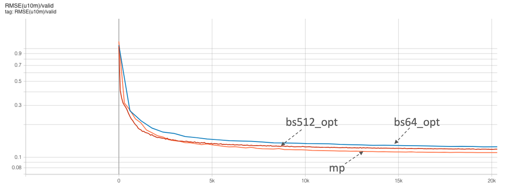

